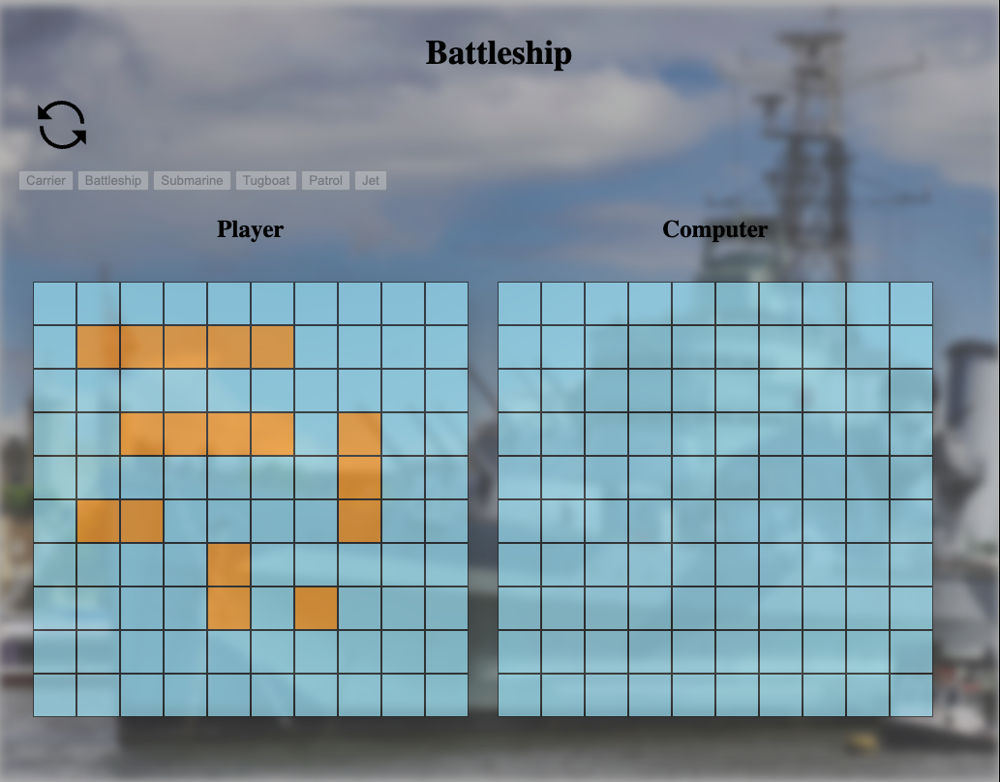

# Battleship project ⛴

&nbsp;&nbsp;&nbsp;
  

Objectives: use Jest unit tests to develop the classic game of Battleship. Organize code with factory functions and modules. Keep DOM manipulation separate from game logic.  

### Screenshot
-----

  

### Things I Learned
-----

- write unit tests with Jest
- set up Jest with webpack and Babel for import and export
- practice with array methods
- practice with objects and factories

